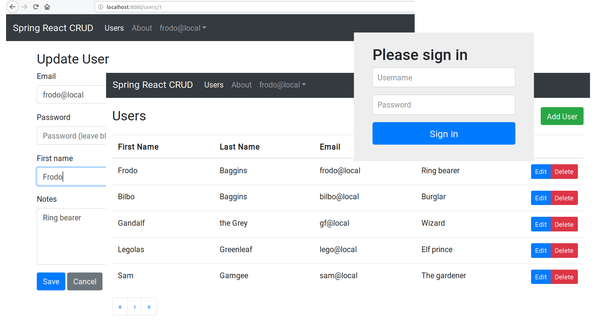

React.js and Spring Data REST - CRUD
====================================

CRUD application with security enabled: a PoC with
ReactJS in the frontend and Spring Data REST in the backend.

Based in the source code here: https://github.com/spring-guides/tut-react-and-spring-data-rest

Guide: https://spring.io/guides/tutorials/react-and-spring-data-rest

The **goal** is to learn better how to use React, and complete the guide but
improving the original code with the following changes and features:

- [X] Make it more appealing, using Bootstrap / HTML5,
      ([reactstrap](https://reactstrap.github.io/)).
- [X] The original application makes a lot of unnecessary requests to only show
      the paginated results (2 initial requests + 1 request × number of items
      in the page), that should be narrowed to just one request.
- [X] Remove the deprecated library [rest.js](https://github.com/cujojs/rest) that
      also does not support standard promises, and replaced by a modern HTTP client:
      [Axios](https://github.com/axios/axios).
- [X] Bookmarkable URLs with [React Router](https://reacttraining.com/react-router/).
- [X] Add a REST browser for development purpose: HAL Browser.
- [X] The entity `Employee` in the original guide is the `User` entity here,
      that was merged with the `Manager` entity.
- [X] Add better client-side validations.
- [ ] Add better server-side validations.
- [X] Add better errors handling.
- [X] Add spinners and loading messages when the app is waiting for
      a response from the API
- [X] Remove Websockets used to update the data in the frontend in "real time",
      most cases like this is unnecessary and a waste of resources,
      even using Websockets.
- [X] Split the JS code in different modules to make it more readable (in the
      original code all the React classes are in just one .js file).
- [ ] Add more features, specially to handle users ...
- [X] Optionally use a real database: **PostgreSQL** :elephant:
  (check [versions](#versions)).

Requirements
------------

- **JDK 8+**
- **Maven 3+**, or you can use the script `./mvnw` instead that it will install
  Maven 3.6 in the user space automatically if the required version isn't there

To build the web assets the project uses **Node.js**, **Webpack**, ...
but all of them are installed and triggered by Maven automatically
in the user space.

Usage
-----

Launch the application with:

    $ mvn spring-boot:run

Or use `./mvnw` instead of `mvn` (`mvnw.cmd` for Window platforms).

Then access the application with http://localhost:8080/, or access
to the API with http://localhost:8080/api/

One of the user to access the app with privileged access is `frodo@local`,
and the password `admin`. Check the initial dataset in
the [DatabaseLoader.java](src/main/java/ar/com/mrdev/app/user/DatabaseLoader.java#L46-L50)
file.

If you access the API through the HAL browser, it will required to sign-in
like with the dash panel using a web page provided by Spring Security,
but if you are going to consume the API with a 3rd party tool
you will need to authenticate using
[HTTP Basic Authentication](https://en.wikipedia.org/wiki/Basic_access_authentication),
eg. with `curl` the `Authorization: Basic ...` header can be generated using
the `-u user:pass` argument:

    $ curl -u gf@local:admin http://localhost:8080/api/users

#### Hot reloading

To edit Javascript or CSS resources and see the changes in the
browser without the need to re-launch the application, execute within
a command line:

    $ npm run watch

And leave it running (if it doesn't work, try with `target/node/npm run watch`).

#### Packaging

Pack the application in a single .jar with all the dependencies
and the web server with:

    $ mvn package

Then you can run the .jar with:

    $ java -jar target/app-0.0.1-SNAPSHOT.jar

### Tests

For now only a test that checks that the spring context
can be loaded is in the source code. Execute with:

    $ mvn test

Versions
--------

For now there are two versions, each one with its own branch:

- `master`: main version with an in-memory database (H2) to quickly
  launch the application without the need of a database installed.
- `postgres`: modified version with PostgreSQL configured,
  ready for "production" usage.

About
-----

**Source code**: https://github.com/mrsarm/spring-react-crud

**Authors**:
* Mariano Ruiz <mrsarm@gmail.com>

**Original Authors**:
* Greg Turnquist (Pivotal)
* Pivotal committers and other contributors

2015-2020  |  Apache-2.0
